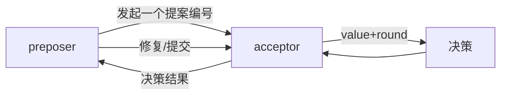
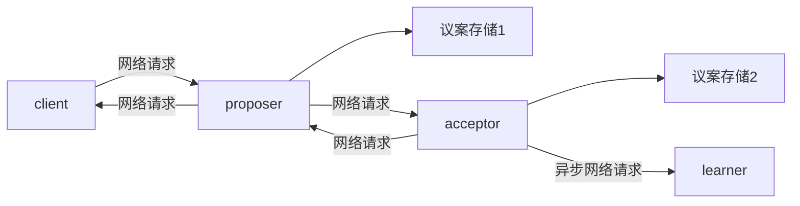
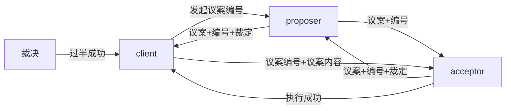

概览
----
定义：基于消息传递的，一致性(共识)算法

>1990年提出，后续的所有算法都是基于此，或增加，或删减，算是鼻祖吧。

随着互联网(微服务)、大数据、虚拟币(区块链) 的兴起后，对分布式的需求更多，应用更多，这哥们的论文就火了

这里先分析一下：2PC 3PC 多数派 算法

2PC
---
>2 phase commit :2阶段提交

角色：
1. 协调者 coordinator
2. 参与者 participant

流程图

优点：
1. 增加一步预执行阶段，一但失败，在第二阶段可以回滚

缺点：
1. 同步阻塞，第一阶段 协调者被阻塞(要等待所有者给定结果)，第二阶段 参与者被阻塞(等待协调者给定提交/回滚) => 可能用性不高，一个节点出问题，全体阻塞
2. 协调者，有单点故障的问题
4. 数据锁定范围被加大：执行完的脚本，但不提交，等待协议者发送二次提交消息
4. 阻塞时间过长：执行完的脚本，但不提交，等待协议者发送二次提交消息
3. 数据可能不一致，如：一阶段有失败的应答，二阶段是回滚，某台机器回滚失败(用重试可日志做修复)

3PC
----
>3 phase commit ：3阶段提交

对比2阶段，加了一步：预发布阶段，其实就是：提前确认一下，如果这一步就有问题，后两步就可以省了（减少了资源锁定范围）
加了定时器：之前的阻塞主要是无法确定双方什么时候有响应或对方不响应，加上定时器后，避免了 阻塞

优点：提交做PING/PONG处理，不做预执行，减少锁定范围与阻塞时间，一但失败，后面两步均省掉了

缺点：太复杂了
1. 协商效率降低
2. 超时机制导致：数据不一致更严重了

quorum
----
多数派协议(法定人数)：只要保证半数+1 写入成功，写就不会丢失 ，读也一样，肯定有一个能读成功。

>感觉跟二阶提交几乎一样，只是在判断的时候：由全成功改为：过半成功

优点：可用性更高，也没那么多网络通信，没有过多阻塞，没有过多数据锁定
缺点：一致性太低

Paxos算法
-----
官方讲解地址
>https://zh.wikipedia.org/zh-mo/Paxos%E7%AE%97%E6%B3%95

Paxos对比上面3种方案其实是：两阶段提交+多数派
>也算是对上面3种方法的优化升级

它又分为3种算法：
1. basic Paxos
2. multi Paxos
3. fast Paxos

#### 角色
1. client:一个节点 | 一台服务器
2. preposer:提案发起者
2. acceptor(voter):提案接收者
5. learner:记录者 ,backup

#### basic Paxos
角色与各节点关系：

简要流程:

注意:
1. 分布式严格来说并不是传统的CS模式，不存在绝对 S 与绝对 c ,每台机器都可以C/S
2. client是包含另外3个角色的，或者把client看成一台服务器，另外3个角色是3个服务进程
3. 3个角色(进程)即有一定关系，又没关系，可各自忙各自的

交互流程：

图有点乱：但至少比较详细的描述一个过程，如果用它官方的图，好看，但是往深了理解有点难

缺点：
1. 活锁（协商效率）
>client1说去吃火锅，另外2个人都同意了，各端ID=1，这个时候client1准备要发送提议内容了，这个时候client2突然说我又想去吃烤肉了，那么另外两个client也同意了，那么此时各端的编号ID=2了，这会导致client1二次发送的提议内容<N，失败了... ，又比如：并行的两种不同类型的提议，也会相互影响
>解决办法也挺简单：两边如果发现自己的提议失败了就等一会(随时时间)，或者达到3次就不再提议了
2. 两次RPC过程
>一次ID提议，一次提议的具体内容收发
3. 太过自由，每台机器都可以是任意角色，各自都可以任意发起议案，各次议案、各种角色混合使用，效率很低

#### multi Paxos
对Pbasic Paxos算法的优化，basic Paxos的核心是高度自由化，人人都可以发言，只要其中一个人再发起一次提案，那前面未完成的提议均作废
multi Paxos:是把高度自由化改为一定自由化，加了一个新角色：leader

第一步：选择出一个leader

之后，每个client要想发出议案，就直接发给leader
leader 再分发广播给其它client，其它client把结果给到leader，leader仲裁，然后最最终结果转发给client1

对比poxos:
1. 多了一次选举过程
2. 各节点之间多了一个心跳，保证leader正常，如出现意外，还要多一次选举过程
1. 原方案发起者两次请求，改成了一次
2. 发起者不需要仲裁了
3. 参与者的请求(响应)，也改为一次了，其实是把两阶段的操作合并成了一次
5. 统一由一个leader来进行发起议案处理，能减少活锁的概率

fast poxos
---
2005年诞生
先看一下poxos的基础流程：

最少要4次网络请求，2次IO
而proposer其实更像是代理者，帮助client完成仲裁过程，它实际上并不是特别关系议案内容，client更关心仲裁、达成共识

多了一次：proposer发送any消息的过程
any消息之后的过程被称为：fast round |  classic round 过程
各端收到any消息：这个编号的提案是OK的，后续具体value做什么，可以两端自行决定

也就是第一阶段还是proposer 来处理，第二阶段proposer不再处理了，而是发一条any消息给两端，让两端直接通信自行决定如何处理

#### fast round
简易流程图：

时序图

它是把原本 proposer 的功能做了减法
proposer ：只收编号ID(不收议案内容)和广播any消息
二阶段的仲裁+广播转交client了

优点：
1. proposer 更轻
    1. 不再传内容
    2. 网络波动它不会成为阻塞点
    2. 第二阶段的提交过程交给client acceptor自己处理
2. client更自由，直接与 accpetor 通信，如何裁决它自己可以决定

比如：如果并发小，没冲突，就是fast round，不需要二次仲裁，client把消息直接发给 acceptor，acceptor 立刻执行提交也不再回消息了

缺点：
1. 多了一步any消息处理
2. 编号虽然通过，但并发高的话，value值可能冲突

感觉 fast round 有点是乐观锁的意思，只要编号投票是正确的，就主观认为二阶段提交也全都能成功

#### classic round
当fast round的values值冲突时，就会退回 到classic round模式，执行补偿操作