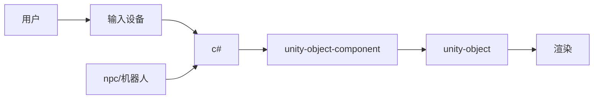
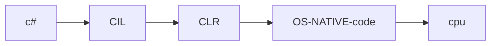
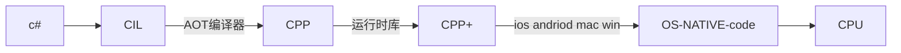
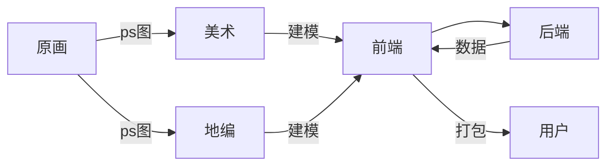

初衷/目的
---
1. 什么是unity?
1. 为什么要用UNITY？
>为什么AR眼镜上跑的是一个安卓OS，而我们用UNITY做主要开发？直接用JAVA写个APK包不也一样能跑起来嘛？
2. 了解/熟悉unity

c#
----
编译 IL   => .exe .dll  =>CLR(runtime) => 汇编 => cpu
CLR
1. 翻译机器指令
2. 优化代码性能
2. GC

不同CPU ，用不同的CLR

>我翻了下UNITY的IDE的目录，里面就有MONO编译器。另外，还有一个C#编译。我不确定它这个C#编译器UNITY自己二次开发过，但我猜：感觉就是微软的编译器

unity 与 c#
---
一个场景，光有动画/渲染，这更像是：动画片/电影，或者说它是一个按照写死的、固定的脚本在显示图像。
那，如果给这个场景上的各种物体加上脚本控制，就有了人机交互的效果了。

>感觉这个东西，跟早期的flash+as3 有点像呢，那为毛最后flash挂了？太吃性能？3D效果不行？

这样人类就能通过输入设备与电脑进行交互，并产生各种好玩儿有趣儿的效果了，如果，再加入网络数据控制，就可以多人联机一起玩。所以，最大的应用，是游戏或元宇宙

unity编译方式
---
1. mono
2. il2cpp

mono编译器
---
1. 将c#转换成中间代码CIL，Common Intermediate Language，也叫 MSIL
   >看了它的源码，有点像汇编，其实跟JAVA的字节码差不多，CLR ≈ JVM
2. 最终运行在：CLR（Common Language Runtime）上

它大概的组成是：
1. c#编译器
2. MONO运行时
3. .net 类库
4. MONO类库

>所以，C#的编译执行原理跟JVM略像，即不是 纯编译型语言，也不是解释型语言，是中间型语言，JIT:just in time

#### mono cil 的3种运行方式 ?
1. jit:just in time ,解释模式，逐条编译成静态代码，送给CPU
2. aot:ahead of time ,提前/预编译模式，cil 部分代码被编译成静态代码，剩下的还是JIT模式。IOS不支持JIT的一些特性'
>如果一个类型或方法是完全通过反射创建出来，AOT编译不过去的
3. fa:full aot，把CLI全部编译成静态代码，送给CPU，IOS 使用

#### 问题：
1. IOS：禁止动态加载代码到内存，并执行。准确的说是：不给用户创建的推内存可执行权限，原因：出于安全性考虑，这样也就是间接禁了JIT模式，间接等于禁了MONO
2. mono好像对64位OS支持不太好，而苹果从2016上架游戏必须支持64位

结合看：IOS下只能选择il2pp，另外 好像PS4 SWITCH XBOX WEBgl  也只能用il2pp

il2cpp编译器
----
1. 将c#转换成中间代码CIL
2. 将CIL转换成CPP
3. 编译CPP

它大概有两个部分：
1. AOP，负载把C#的cil转换成CPP文件
2. 运行时库，再给CPP添加一些基础库，如：GC垃圾回收、文件FD管理等

mono il2cpp 对比
---
1. 编译时间 肯定mono快，il2cpp 非常慢
2. mono支持一些高级特性，像：反射，而IL2CPP是纯静态编译，不支持
3. 每一个平台就得有一个monoVM，它可以全覆盖(其实也挺难)，但不能把每个平台所有特性全覆盖，像IOS就不支持内存映射可执行代码，反过来il2cpp是C++，所有平台都支持
4. 包的大小，MONO肯定更小
5. 运行效率肯定是 il2cpp更快，它都编译好了，不用动态编译了
6. mono毕竟是用微软的方案，具说新版的C#，微软并没授权给mono，另外，微软也有自己的.net5，这样：mono对C#和CLR的一些新特性用不了，且感觉挺尴尬的.

***

既然mono 的full aop是全编译，那il2cpp 也是全编译，那这两个有什么区别？
>编译器不同，这里我不确定mono full aot 全编译后，是不是还需要MONO-VM，也就是：虽然是全编译，但还得在monoVM上再执行一次，而如果它真的是直接用OS底层的C++编译器编译，那么其实跟il2cpp差别不太大，也应该能正常运行

总结：
1. MONO是自己的编译器，如果 MONO 无法兼容所有平台的所有特性 ，那肯定不行
2. il2cpp 使用的是当前平台上的主流C++编译器，肯定是兼容，且是比较完美的兼容

另外，这个native code是如何编译的？是到各大平台官方下载C++编译器，还是说，直接用xcode andriod 编译器编译呢？

jit
---
1. 接收cil指令，将该指针直接转换成机器码(汇编代码，或者叫比特流也OK)
2. 用户在堆上申请一块内存
3. 将机器码映射到内存中(mmap),模拟动态创建函数
4. 交给CPU执行
5. 接收返回结果

这里MMAP的参数中，就有一个参数是：映射区域可被执行,映射区域可被执行

>ios 就是把第3、4步给禁掉了，准确的说是禁了mmap的参数

跨平台
---
分成两个部分
1. UI/场景
   渲染 碰撞 重力
2. 脚本层
   C#，不管是mono 或 il2cpp，其核心都是实现跨平台。写一套代码，全平台可用。另外：这一套通用的代码最好是高级语言，便于开发
3. IDE
   mac win 都有

所以结合看，UNITY的两大核心都能实现全平台通用，即能一套代码通用，并且有很好的3D渲染能力，再配合自己开发的IDE做开发，那必然就火了
>好像 web 端貌似不行

LUA
----
C#也是编译型语言，虽然是中间型编译语言，但也毕竟走了编译这个流程，那么它是无法做到动态语言的特性的。
那，如果像热更这种，是不是就不能实现？或者说IOS PS5 这些只支持C++静态编译这种，无法实现动态化呢？
这里就可以配合LUA一起使用了，实现:热更新,动态语言辅助静态语言的方式

客户端安装的游戏包：肯定是UNITY编译好的，可能是IL代码，也可能是CPP代码，总之客户端不会再编译代码了(就算是IL模式，也是由CLR进行编译执行送往CPU)。总之：客户端没有再安装其它编译软件，也不执行编译代码过程。

这时，如果有一个C/C++编写的公共库，一并打包(已编译)到安装包里，被客户端下载，我们的游戏安装包里编译好的代码，能直接调用客户端这个库，就实现了，动态热更

jit 与 lua 区别
----
jit的底层逻辑就是真的创建CPU可执行的指令，动态的创建。
而LUA并不是真实的创建CPU指令

CLR JVM 对比
-----
具体它两个谁抄袭谁不太好说

相似：

1. 两个虚拟机（VM）
1. 两者都包括垃圾收集
1. 两者都采用基于堆栈的操作
1. 两者都包含运行时级别的安全性
1. 两者都有异常处理方法
1. CLR和JVM之间的主要区别包括：

非相似:
1. CLR被设计为与语言无关，JVM被设计为特定于Java
1. CLR最初仅与Windows兼容，JVM可与所有主要操作系统一起使用
1. CLR使用JIT编译器，JVM使用称为Java HotSpot的专用JIT编译器
1. CLR包括用于闭包，协程和指针的声明/操纵的指令，而JVM不包括
1. JVM与更强大的错误解决方案和生产监视工具兼容

个人总结：JVM可能更倾向于跨平台，或者说当初就是为了干掉WIN的不跨平台而生的。而CLR更像是套标准，一个工具集，不仅仅是跨平台，对开发者更友好。

什么是unity?
----
好像提到unity都有提3D，那如果是单纯的3D视觉，那跟做电影的公司就很像了，那为毛还有UNITY？
个人觉得：unity的核心应该是3D视觉+物理引擎+脚本控制 => 可以虚拟真实的世界
由此得出：如果跳出游戏行业，比如：汽车，辅助驾驶的AI计算出一定的结果，需要渲染出：虚拟的线、虚拟其它的车，以及其它车与本车的距离等等。AR眼镜上：也要虚拟渲染出一些3D物体，然后与眼镜与人交互等等吧。
总之：但凡要虚拟出3维世界的物体，还要有交互功能，那可能UNITY就是比较好的选择。

unity工种
----
2. 原画/Ui(PS)
1. 美术 (maya 3dmax)
2. 地编
2. 主程
3. 前端
4. 后端

总结
----
结合初衷分析：
1. UNITY能做3D渲染，在视觉上更好
2. UINITY有跨平台功能，一套代码即可运行多端。
3. UNITY它的基础组件：碰撞 重力 IDE绘画场景 都非常强，如果这些全自己搞，那就真的太扯蛋了。

既然UNITY如此强，如：以元宇宙来说明，完全可以虚拟整个平行世界，那是否能取代传统普通型的APP开发呢？
貌似看没这个趋势，我的理解是：传统APP没有那么复杂，并不需要那么多的3D视频效果，也不需要互动(碰撞 策略)，最基本的显示些文字图片够了，再补上点视频流，妥妥够用。UNITY开发成本略高。而，如果需要3D的话，用UNITY打个类包，嵌入一下也行。或者，先用UNITY开发游戏代码，打包成APK，再二次开发这个包(加入安卓代码)。

